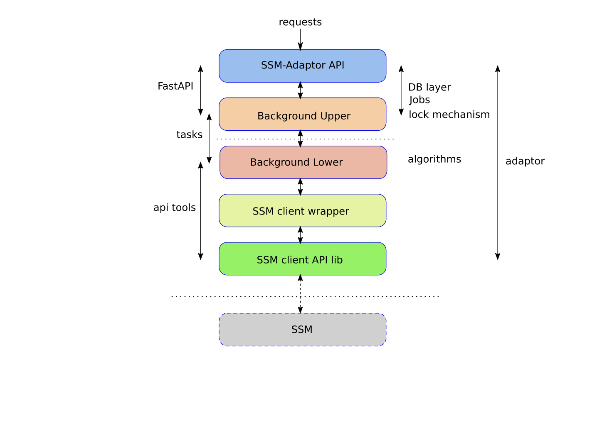
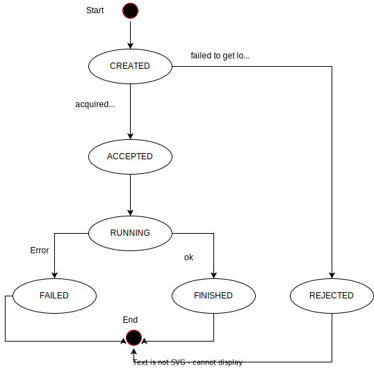

# SSM-Adaptor Microservice (Spyderisk v3.5.x API compatible)

The adaptor is a Python-based web application microservice designed to expand
or customize the functionality of the [Spyderisk System Modeller](https://github.com/Spyderisk/system-modeller) (also known as "SSM"). It utilizes the Spyderisk REST API and runs on
[FastAPI](https://fastapi.tiangolo.com/).

## Deploying SSM-Adaptor

The default configuration of the SSM-Adaptor can be customized through the
'.env_adaptor' file. To get started, please make a copy of the provided
`.env_adaptor.template` file and rename it to `.env_adaptor`. Then, you can
modify any of the default parameters in the `.env_adaptor` file to match your
specific environment configuration.

There are several ways to deploy the SSM-Adaptor service:

### Stand-alone SSM-Adaptor with docker compose

This deployment relies on an external Spyderisk service.

Edit `.env_adaptor` file and adjust the SSM_URL variable with a valid SSM
service URL.

Run the service

```sh
docker-compose -f docker-compose-standalone.yml --env-file .env_adaptor up -d
```

The SSM-Adaptor endpoint will be listening on port 17643

### SSM-Adaptor with Spyderisk (SSM)

This deployment includes a local instance of Spyderisk. Configuration
parameters are stored in .env_adaptor.

Run the service:

```sh
docker-compose -f docker-compose.yml --env-file .env_adaptor up -d
```

The adaptor service will be accessible from
`http://localhost:8089/system-modeller/adaptor`, and the SSM service from
port 8089/system-modeller.

### SSM-Adaptor with Spyderisk (SSM) dev mode

This deployment includes a local instance of Spyderisk. Configuration
parameters are stored in .env_adaptor. The host folder is mounted via the
volume ./code directly to the adaptor container.

Run the service:

```sh
docker-compose -f docker-compose-dev.yml --env-file .env_adaptor up -d
```

The adaptor service will be accessible from
`http://localhost:8089/system-modeller/adaptor`, and the SSM service from
port 8089/system-modeller.

Check the adaptor container logs with:

```sh
docker-compose -f docker-compose-dev.yml --env-file .env_adaptor logs -f ssm-adaptor
```

The adapter container can be restarted at any point to incorporate code changes
made in the host folder, e.g.

```sh
docker-compose -f docker-compose-dev.yml --env-file .env_adaptor restart ssm-adaptor
```

### Build SSM-Adaptor docker image

Build docker image:

```sh
docker build -t ssm-adaptor .
```

## SSM-Adaptor Configuration

The core of the microservice code is common to serve both FogProtect and
ProTego. Edit `.env_adaptor` and define the environment variable `SSM_URL` to
your SSM service, mainly:

```
PROJECT_NAME=SSM Adaptor Microservice

SSM_ADAPTOR_MODE=all

ROOT_PATH=/system-modeller/adaptor

SSM_URL=http://ssm-proxy:80/system-modeller

DATA_FOLDER=/data
LOG_FOLDER=/logs

KAFKA_ENABLED=False

POLLING_DELAY_1=4
POLLING_DELAY_2=2

LOGGING_LEVEL=DEBUG

MAX_RISKS=10

ACCEPTABLE_RISK_LEVEL=Medium

FILTER_LOW_LEVEL_RISKS=TRUE

GET_ASSET_METADATA_FROM_VULN=TRUE
FP_DISABLEMENT_CONTROL=DisabledDataFlow

RISK_CALC_MODE=CURRENT

OPENVAS_REPORT_FILE_LOCATION=/code/tmp

MAX_THREATS=10

DOMAIN_MODEL_VERSION=5
```

### Dev, FogProtect and ProTego Modes

The `SSM_ADAPTOR_MODE` variable controls the exposed microservice API and
takes the following values:

- `PROTEGO`
- `FOGPROTECT`
- `ALL`

The names Protego and FogProtect refer to specific EU projects that also funded
some Spyderisk development.

## Code Structure

The current deployment of the microservice is based on the [FastAPI
Framework](https://fastapi.tiangolo.com) which is a modern, fast
(high-performance), web framework for building APIs with Python 3.8+ based on
standard Python type hints.

The main reasons for migrating the microservice code to FastAPI were modularity and
asynchronous non-blocking call support.

The main components are:

- `app` the main microservice FastAPI code
- `ssm_api_client` python client library for the Spyderisk API
- `openapi` openapi json docs
- `test` various test code/scripts/examples

```
.
├── app
│   ├── api
│   ├── core
│   ├── crud
│   ├── db
│   ├── main.py
│   ├── models
│   └── ssm
├── docker-compose.yml
├── docker-compose-dev.yml
├── docker-compose-standalone.yml
├── Dockerfile
├── openapi
│   └── ssm
├── README.md
├── requirements.txt
├── ssm_api_client
│   ├── api
│   ├── api_client.py
│   ├── configuration.py
│   ├── exceptions.py
│   ├── __init__.py
│   ├── models
│   └── rest.py
└── tests
```

### The `app` component

- `api` API endpoints
- `core` Core functionality, e.g. configuration
- `crud` CRUD functionality to support endpoints
- `db` Mongo DB connection support
- `models` models to handle data json structures and db collections
- `ssm` SSM client class, and background tasks support, e.g. algorithms

#### Layered structure



- external SSM API Client level. No need to change code in ssm_api_client
  unless the SSM API is changed. Other API's client libraries, e.g. kafka,
  should be included in this layer.

- SSMClient layer, this is a wrapper class around the SSM API Client library,
  it provides generic functionality that is required by the microservice API
  operations, e.g. `get_full_model`, `apply_control`, etc.

- Tasks foreground and background are the main methods that implement the
  SSM-Adaptor functionality, e.g. `mitigation algorithm`, or `calc_risk`

- Top level Router methods that start the execution path of a request and
  correspond to the API endpoints. API requests servicing should be handled by
  foreground and background tasks.

## Background and Foreground Task lifecycle

The actual request serving should be executed by a task/job in either blocking
or non blocking way. The lifecycle of a task involves the following stages:

- CREATED, created upon incoming requests
- ACCEPTED, session lock acquired
- RUNNING,
- FINISHED,
- REJECTED, e.g. failed to acquire a session lock
- FAILED



The job status model:

```json
{
  "modelId": "string",
  "status": "CREATED",
  "err_msg": "string",
  "created_at": "2021-05-19T14:25:08.517Z",
  "updated_at": "2021-05-19T14:25:08.517Z",
  "messages": "string",
  "id": "string"
}
```

## Exceptions and HTTP Return Codes

Execution paths should include try and catch blocks to handle exceptions.
Background tasks should raise an exception. Blocking API tasks should raise an
`HTTPException`, which will terminate the thread serving the request. In both
cases, an update of the job status to "FAILED" should be executed before
raising an exception.

## Session locking mechanism

A basic session locking mechanism is introduced, the main idea is that each
task that operates with an SSM model call has to acquire a lock first. Failing to
acquire the lock, the task should return a HTTP 423 error code.

Locks are allocated per SSM model webkey, i.e. each model has its own lock.

A task, or foreground/background job should be registered first as `CREATED`
and then will try to acquire the model lock, failing to do so the task status
should be changed to `REJECTED` and raise an HTTPException HTTP_423_LOCKED.

The key attributes of a lock object are:

- model ID
- task job ID
- status [`LOCKED`|`UNLOCKED`]

There are two main methods:

- acquire_session_lock()
- release_session_lock()

How it can be applied:

```python
vjob = await create_vjob(db, {"modelId": modelId})
if not vjob:
   raise HTTPException(status_code=status.HTTP_404_NOT_FOUND,
                 detail="Failed to create calc-risk job")

vjob_id = str(vjob.id)
logger.info(f"calc risk job {vjob}, {vjob_id}")

# acquire session lock
lock_acquired = await acquire_session_lock(db, vjob_id)

if not lock_acquired:
   # update status of job as REJECTED
   await update_status(db, vjob_id, "REJECTED")
   raise HTTPException(status_code=status.HTTP_423_LOCKED,
            detail="Resource is locked by another process, try again later.")

...

await release_session_lock(db, vjob_id)
```

## Generate SSM client library stubs with [OpenAPI](https://github.com/OpenAPITools/openapi-generator#Overview)

### Install the OpenAPI generator using NPM

As prerequisites `java` and `npm` are required, e.g.

```sh
sudo apt-get install npm
sudo apt-get install openjk-18-jre-headless
```

Then continue with the installation of the openapi-generator:

```sh
# install the latest version of "openapi-generator-cli"
npm install @openapitools/openapi-generator-cli -g
# install a specific version of "openapi-generator-cli"
npm install @openapitools/openapi-generator-cli@cli-4.3.1 -g
# Or install it as dev-dependency in your node.js projects
npm install @openapitools/openapi-generator-cli -D
```

create a `config.json` file:

```json
{
   "modelPackage": "models",
   "apiPackage": "api",
   "packageName": "ssm_api_client"
}
```

### Generate the SSM API python client library (ssm_api_clinet_v{x})

Before generating the client library the derived openapi yaml file requires few
minor adaptations. Use an editor and change the following:

- date-time types should be converted to `string` and the type should be
  `int64`
- references to `getaLabel` and `getmLabel` should be converted to `aLabel` and
  `mLabel`.

There is a tool in `tools/pre_fix_api.sh` that can apply those changes
automatically.

After editing the YAML file, generate the client code using the following line:

```sh
mkdir client
openapi-generator generate -i openapi.yaml -g python -o client/ -c config.json
```

Edit generated code and add the `ssm_api_client` prefix in the following files
`import` statemetns:

- ssm_api_client/__init__.py
- ssm_api_clinet/api/___init__.py

Alternatively use a bash script in `tools/post_fix_api.sh` to apply those
changes.

e.g. `tools/post_fix_api.sh ssm_api_client`

## Licence

The software is Copyright 2023 University of Southampton IT Innovation Centre and licensed under the Apache 2.0 license.

## 3rd Party Licenses

CSV files used for alert mappings are provided to you with licenses which can
be found within app/static/mappings. As a quick summary the licenses for each
file are:

- cwec.csv - Non-exclusive, royalty-free for research, development,
  and commercial purposes
- wasc.csv - CC-BY 2.5
- capec.csv - Non-exclusive, royalty-free for research, development,
  and commercial purposes
- owasp_top10_2010.csv - CC-BY-SA 3.0
